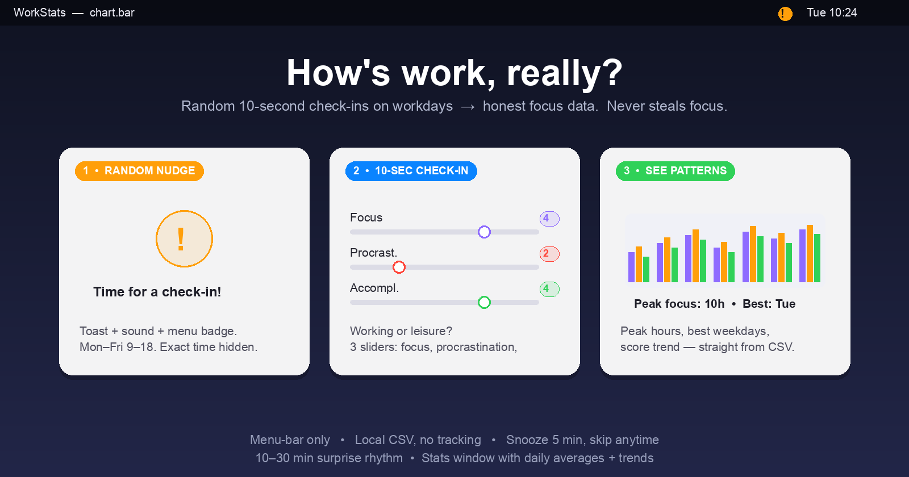
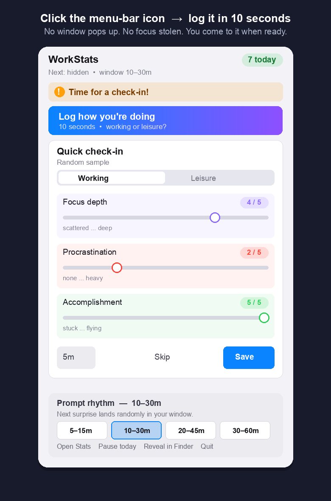
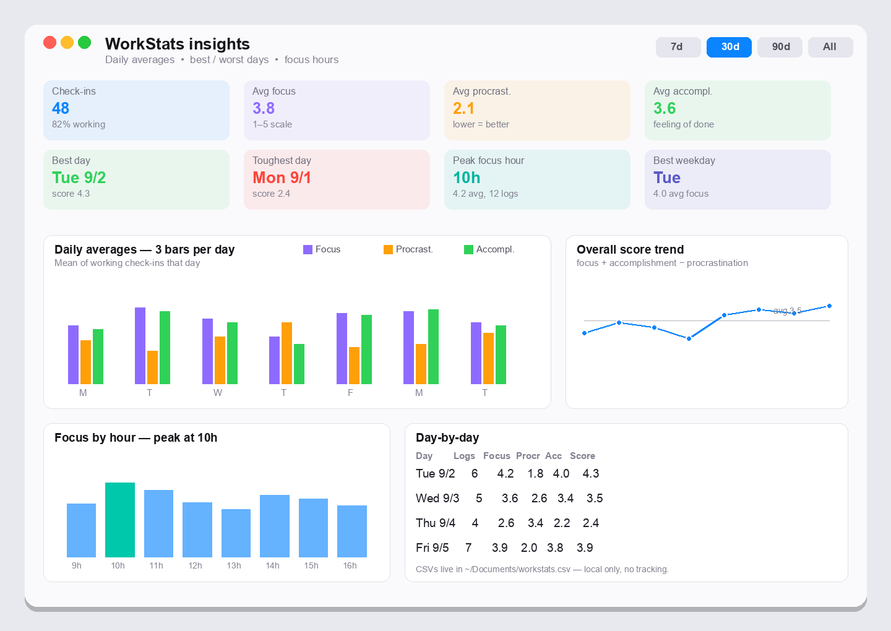

# 📊 WorkStats

Menu bar sampler for work sentiment. Random prompts during workday, 10-second check-in, everything lands in a CSV. Stats window shows daily averages, trends, best/worst days, peak focus hours.



| 10-second check-in | Patterns over time |
|---|---|
|  |  |

## ✨ Features

- 🧭 Menu bar only (`LSUIElement`), no dock icon
- 🎲 Random prompts, Mon–Fri 9:00–18:00, surprise mode (exact time hidden 🤫, 👁️ to reveal)
- ⏱️ Prompt rhythm: default 10–30 min window, restarts after every submitted check-in; collapsible presets ⚡️5–15 🌱10–30 ☕️20–45 🧘30–60, persisted
- 🔔 Native toast (top-right) + system sound (time-sensitive, breaks through most Focus modes) + 🔔 menu-icon badge. Never steals focus, never pops a window — check in from the dropdown when ready. Tip: in Settings → Notifications → WorkStats pick **Alerts** so the toast stays until dismissed
- ✏️ Inline check-in form in dropdown (manual entries never leave menu)
- 💼/☕ Working vs Leisure; leisure rows skip sliders
- 🎯 Focus depth 1–5 (5 = green), 🌀 Procrastination 1–5 (1 = green, 5 = red — lower is better), 🏆 Feeling of accomplishment 1–5
- 😴 Snooze 5 min, Skip, 💾 Save with confirmation flash
- 🧾 CSV log at `~/Documents/workstats.csv`
- 📈 Stats window: daily 3-bar chart, score trend, focus-by-hour, focus-by-weekday, best/worst day cards, day-by-day table, 7d/30d/90d/All ranges
- ✨ Demo data seeder (empty-state + footer) for instant graph preview

## 🚀 Run

Requirements: macOS 13+, Swift toolchain (full Xcode **not** needed).

```sh
./build-app.sh
open WorkStats.app
```

`build-app.sh` runs `swift build -c release`, bundles `WorkStats.app` (`Contents/MacOS/WorkStats` + `Info.plist`). First launch asks notification permission; allow it for 🎲 prompts.

Keep app running in background during workday.

## 🚀 Start at login

Easiest: dropdown → **🚀 Start at login** toggle (uses `SMAppService`, macOS 13+).
Tip: move `WorkStats.app` to `/Applications` first — the system trusts it more there.

Manual fallback: **Settings → General → Login Items → + → WorkStats.app**.
Note: locally built unsigned apps can be blocked from auto-registering; the toggle then shows the manual path.

## 🖱️ Use

| Action | Where |
|---|---|
| ✏️ Check in now | Menu bar dropdown → expands inline form |
| 🎲 Random prompt | Banner + sound + icon badge; form auto-expands in dropdown |
| 😴 Snooze 5m | Survey form button, re-fires as `snoozed` |
| ⏸️ Pause / ▶️ Resume | Dropdown, pauses until resume (no persist across relaunch) |
| 📈 Open Stats | Dropdown → `Stats` window |
| 📄 Open CSV / 📁 Reveal | Dropdown |
| ❌ Quit | Dropdown |

## 🧾 Data (CSV)

Path: `~/Documents/workstats.csv`

Header:

```csv
timestamp,mode,focus_depth_1_5,procrastination_1_5,accomplished_1_5,trigger
```

Example:

```csv
2026-09-03T10:24:11.123Z,working,4,2,4,random
2026-09-03T12:05:44.000Z,leisure,,,,manual
```

- `timestamp`: ISO8601 UTC
- `mode`: `working` | `leisure`
- Sliders empty on leisure rows
- `trigger`: `random` | `manual` | `snoozed` | `demo`

## 📈 Stats logic

- Daily averages use working check-ins only; leisure counts toward volume + working-%.
- Score (higher = better): `(focus + accomplishment + (6 − procrastination)) / 3`, 1–5 scale.
- 🌟 Best / 🐌 toughest day = max / min daily score.
- ⏰ Peak hour = hour (9–17) with highest mean focus. 📅 Best weekday likewise.
- Charts: Swift Charts, y-domain 0–5.5.

## 🛠️ Project layout

```text
Package.swift                  # swift-tools 5.9, macOS 13+, executable target
Info.plist                     # CFBundle* + LSUIElement=true
build-app.sh                   # release build → WorkStats.app bundle
Sources/workstats/
  WorkStatsApp.swift           # @main App, MenuBarExtra + Windows, scheduler wiring
  MenuBarView.swift            # dropdown: header, inline form toggle, actions
  SurveyView.swift             # SurveyFormView (shared) + SurveyView (popup)
  Scheduler.swift              # 20–40min timer, 9–18 weekday window, UNUserNotification
  Checkin.swift                # model + csvRow()
  CheckinStore.swift           # append + today count, ~/Documents/workstats.csv
  StatsEngine.swift            # CSV parse, daily/hour/weekday aggs, demo seed
  StatsView.swift              # stats window, charts, cards, table
```

No third-party deps. `import Charts` (system), `UserNotifications`, `AppKit`, `SwiftUI`.

## ⌨️ Dev

```sh
swift build          # debug build
./build-app.sh       # release + .app bundle
```

Edit prompts/schedule in `Scheduler.swift` (`minInterval`/`maxInterval`, `isWorkTime`, `nextWorkTime`). Edit questions in `SurveyView.swift`. Edit aggs in `StatsEngine.swift`.

## 🔒 Privacy

Local only. No network, no telemetry. Data lives in your Documents CSV. Delete file to wipe history.
